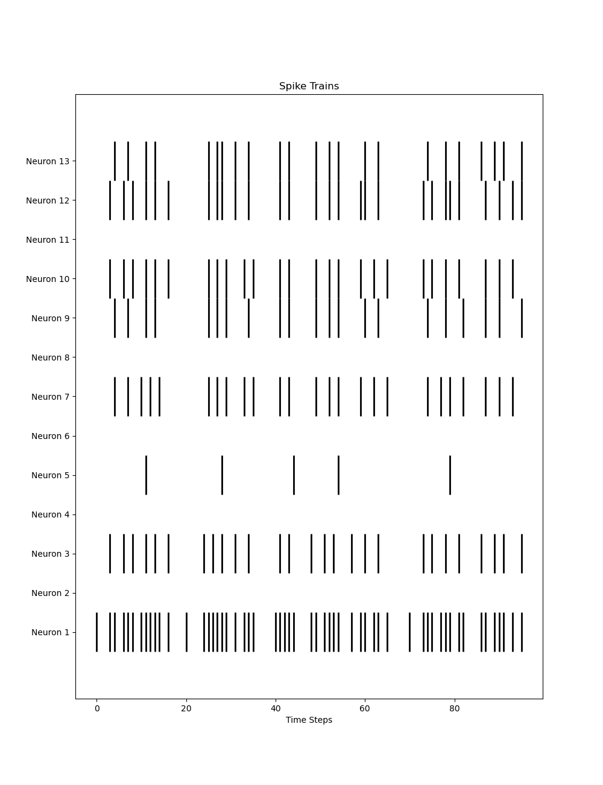
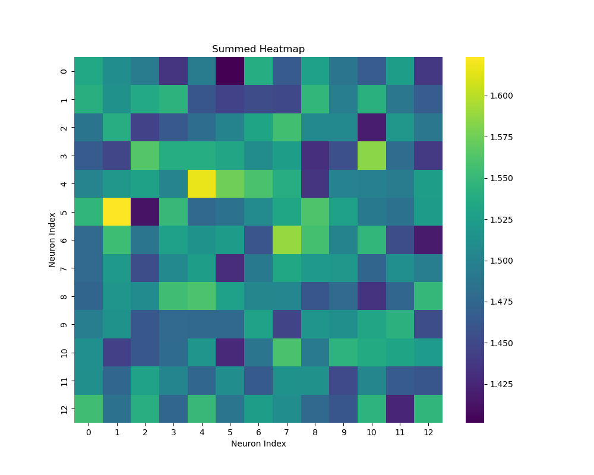

# SNN-Hawkes-Process

## Overview
This repository contains implementation of Spiking Neural Network (SNN) with leaky integrate-and-fire (LIF) neurons. The SNN is optimised using an evolutionary algorithm. The connectivity of the SNN is modelled with Hawkes processes. The Hawkes processes are fitted using MCMC. The primary focus is train SNN and analyzing its neural interactions. The repo provides a toy example of classifying between a sine and cosine function. The spike trains of the SNN are stored and Hawkes processes model the interactions between those. As results we get a neural interaction matrix alpha as heatmap. 

## Contents
1. `hawkes_model.py` - Contains the `HawkesProcessModel` class used for modelling the Hawkes process in a neural network.
2. `spiking_network.py` - Contains a neural network using leaky integrate-and-fire (LIF) neurons.
3. `train_snn.py` - Trains the SNN based on an evolutionary algorithm (CMA-ES) and generates spike trains. 
4. `fit_hawkes_process.py` Fits Hawkes processes to the spike trains and derives the alpha interactions matrix between the neurons. 
5. `plot_alpha_heatmaps.py` Plots the interactions matrix as heatmap to visualise the relationships among neurons.

## Installation
To run these scripts, you need to have Python installed along with the following libraries:
- numpy
- torch
- matplotlib
- seaborn
- cma
- sklearn

You can install these dependencies using pip:
```bash
pip install numpy torch matplotlib seaborn cma sklearn
```

## Usage

### Modelling with Hawkes Process
To use the Hawkes process model, import the `HawkesProcessModel` class from `hawkes_model.py` and initialize it with the appropriate parameters.

### Training the Neural Network
Execute `train_snn.py` to train the SNN and evaluates the classification. The script stores the derived spike trains from the SNN. 

### Fitting Hawkes model
Run `fit_hawkes_process.py` fits the Hawkes processes to the spike trains of the SNN. The script generates the alpha and beta parameters of the Hawkes model.

### Plot the alpha parameters
The `plot_alpha_heatmaps.py` visualises the interaction between neurons of the SNN, by plotting the alpha parameters of the Hawkes model.


## Example Spike Trains of SNN


## Example interaction matrix visualisation
